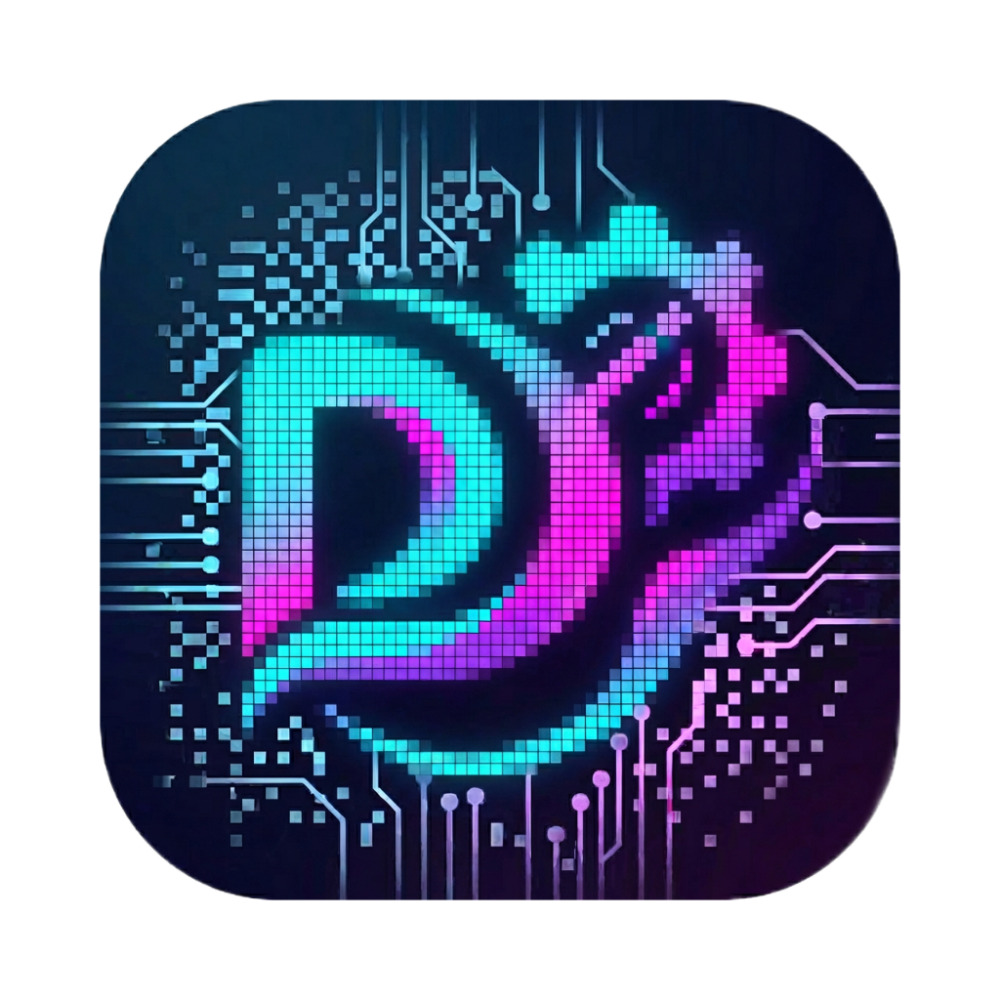

<p align="center">
  
</p>

<h1 align="center">Divoom Monitor</h1>

<p align="center">
  Desktop-приложение для управления устройствами <a href="https://www.divoom.com/">Divoom</a> (Pixoo, Times Gate и др.) по локальной сети.<br/>
  Построено на <strong>Tauri 2 + Vue 3 + Rust</strong>.
</p>

<p align="center">
  <a href="https://github.com/Pisyukaev/divoom-monitor/releases"></a>
  <a href="https://github.com/Pisyukaev/divoom-monitor/blob/main/LICENSE"></a>
</p>

<p align="center">
  <strong><a href="README.md">English version</a></strong>
</p>

---

## Возможности

### Обнаружение устройств
Автоматический поиск Divoom-устройств в локальной сети через официальный Divoom API. Отображается тип устройства, IP/MAC-адрес, уровень сигнала и статус подключения.

### Управление устройством
- Регулировка яркости
- Включение/выключение экрана
- Зеркальное отображение
- Переключение формата температуры (°C / °F)
- Переключение 12/24-часового формата
- Перезагрузка устройства

### Настройка экранов (Times Gate)
- Визуальный редактор для каждого экрана
- Загрузка изображений с компьютера или по URL
- Добавление текстовых элементов с настройкой шрифта, позиции и размера
- Отправка конфигурации на устройство

### Мониторинг системы
- Отображение загрузки CPU, GPU, RAM и дисков
- Температуры процессора и видеокарты (Windows, через LibreHardwareMonitor)
- Режим **PC Monitor** — автоматическая отправка метрик на устройство каждые 2 секунды

### Настройки приложения
- Тёмная и светлая тема
- Автозапуск при старте системы
- Сворачивание в системный трей
- Проверка и установка обновлений прямо из приложения
- Поддержка русского и английского языков

---

## Стек технологий

| Слой | Технологии |
|------|-----------|
| Backend | Rust, Tauri 2 |
| Frontend | Vue 3, TypeScript, Vite |
| UI | Element Plus |
| Системные метрики | .NET 6 sidecar (LibreHardwareMonitor) |
| CI/CD | GitHub Actions, Tauri Action |

---

## Установка

Скачайте последний релиз со страницы [Releases](https://github.com/Pisyukaev/divoom-monitor/releases) и запустите установщик.

Приложение поддерживает автообновление — при выходе новой версии вы получите уведомление прямо в настройках.

---

## Сборка из исходников

### Требования

- [Node.js](https://nodejs.org/) (LTS)
- [pnpm](https://pnpm.io/)
- [Rust](https://www.rust-lang.org/tools/install)
- [.NET 6 SDK](https://dotnet.microsoft.com/download/dotnet/6.0) (для сборки sidecar на Windows)

### Шаги

```bash
# Клонировать репозиторий
git clone https://github.com/Pisyukaev/divoom-monitor.git
cd divoom-monitor

# Установить зависимости
pnpm install

# Собрать sidecar для мониторинга температур (Windows)
pnpm build:sidecar

# Запустить в режиме разработки
pnpm start

# Собрать продакшн-билд
pnpm tauri build
```

### Переменные окружения

Скопируйте `.env.example` в `.env` и при необходимости настройте:

| Переменная | Описание | По умолчанию |
|------------|----------|-------------|
| `LHM_SIDECAR_PATH` | Путь к исполняемому файлу HardwareMonitorCli | `sidecar/HardwareMonitorCli.exe` |

---

## Лицензия

MIT
